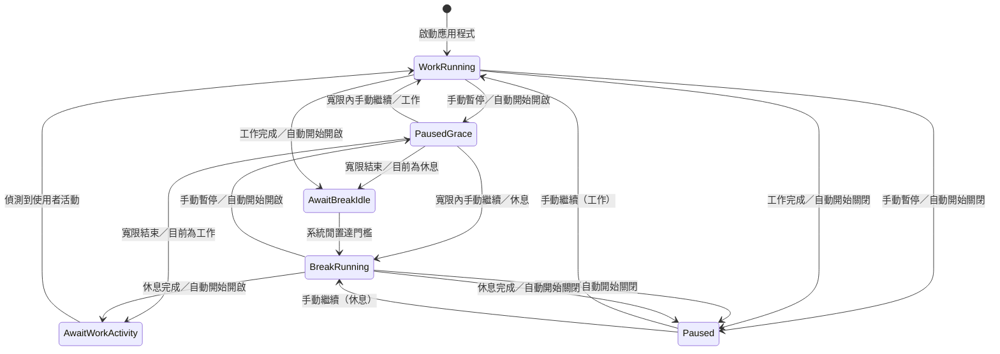

# Pomodoro Tauri + Vue 重寫規格

> 文件狀態：Draft 0.4  
> 盤點基準：目前 repository 中的 Electron 14 + Vue 3 實作  
> 目標：以 Tauri 2 + Vue 3 重寫，保留番茄鐘的核心工作流程與波浪視覺語意，並修正現有計時與狀態設計的技術問題。

## 1. 產品摘要

這是一個常駐桌面的番茄鐘。工作期間，視窗中的波浪會隨工作進度由下往上升；進入休息後，波浪會隨休息倒數由上往下降。工作結束時提醒使用者停止工作、喝水或活動；休息結束時提醒使用者回到工作。

應用程式採小型、透明、無原生邊框且可置頂的桌面視窗，讓進度可以長時間留在桌面上，但不需要打開完整的工作管理介面。

## 2. 重寫目標

### 2.1 必須達成

- 使用 Tauri 2、Vue 3、Vite 與 TypeScript。
- Windows、macOS、Linux 均為第一級支援平台。x86_64 三平台都必須發行；ARM64 第一版以 Windows 與 macOS 為必要目標，Linux ARM64 列為後續擴充。
- 工作與休息採可設定的倒數時間。
- 工作時波浪上升，休息時波浪下降，階段切換時波浪位置連續。
- 支援開始、暫停、繼續，以及工作／休息自動銜接。
- 工作結束時顯示休息提醒；休息結束時顯示工作提醒。
- 保留桌面閒置時間判斷所形成的自動開始行為。
- 支援透明、無邊框、小尺寸、可置頂的主視窗。
- 設定需跨應用程式重開保存。
- 計時不應因 `setInterval` 漂移、視窗背景化或電腦睡眠而明顯失準。
- 僅允許單一應用程式實例；再次啟動時聚焦既有主視窗。

### 2.2 第一版不包含

- 帳號、登入與雲端同步。
- 任務清單、專案管理、統計報表與番茄歷史。
- 多裝置同步。
- 手機版本。
- 複雜的主題市集或波浪樣式編輯器。

## 3. 現有專案分析

### 3.1 技術結構

目前專案源自 Vite Electron Builder 範本，README 仍主要是範本說明，產品行為沒有正式文件。

| 區域 | 現況職責 |
| --- | --- |
| `packages/main` | Electron 視窗、IPC、單一實例、桌面閒置秒數、更新功能 |
| `packages/preload` | 將視窗、通知、閒置時間等 Electron API 暴露給 renderer |
| `packages/renderer` | Vue 畫面、計時流程、設定表單、波浪與提醒視窗 |
| `tests` | 只有應用程式能開啟的 Playwright smoke test，沒有產品行為測試 |

現有主要畫面檔案：

- `Pomodoro.vue`：工作／休息模式、通知、閒置偵測與自動開始流程。
- `Timer.js`：每秒倒數。
- `TheBackground.vue`：波浪高度及水平擺動。
- `Setting.vue`：倒數、提示文字、置頂與更新設定。
- `NotifyWindow.vue`：點擊任意位置即可關閉的提醒視窗。

### 3.2 現有預設值

| 設定 | 現有值 | 重寫初始預設 |
| --- | ---: | ---: |
| 工作時間 | 1,500 秒（25 分鐘） | 保留 |
| 休息時間 | 300 秒（5 分鐘） | 保留 |
| 閒置門檻／檢查週期 | 60 秒 | 先保留，重寫時拆成清楚欄位 |
| 工作提醒文字 | `Work` | `休息結束，回來工作囉！` |
| 休息提醒文字 | `Drink a water` | `工作時間結束，休息一下、喝口水吧！` |
| 視窗置頂 | Electron 視窗預設 `true` | 保留 |
| 主視窗尺寸 | 200 × 600 | 保留為初始尺寸 |
| 提醒視窗尺寸 | 600 × 300 | 前兩次保留；第 3 次起逐次放大 |

### 3.3 現有實際流程

1. 開啟程式後立即進入工作階段並開始 25 分鐘倒數。
2. 工作倒數結束：
   - 切換為休息階段，但先停在休息起點。
   - 顯示系統通知和自訂提醒視窗，內容為休息提示文字。
   - 每隔 `autotime` 秒讀取系統閒置時間。
   - 使用者仍在操作電腦時，重複休息提醒。
   - 系統閒置時間大於門檻後，正式開始休息倒數。
3. 休息倒數結束：
   - 切換為工作階段，但先停在工作起點。
   - 顯示工作提示文字。
   - 每隔 `autotime` 秒檢查；偵測到使用者重新操作電腦後，正式開始下一輪工作。
4. 使用者可用按鈕暫停或繼續，但現有「暫停」也會進入上述自動開始檢查，並非無限期暫停。

### 3.4 現有波浪行為（相容性基準）

現有程式以 `h` 表示波浪填充百分比：

```text
工作：h = (duration - remaining) / duration × 100
休息：h = remaining / duration × 100
```

因此：

| 時點 | 工作階段 h | 休息階段 h |
| --- | ---: | ---: |
| 開始 | 0% | 100% |
| 一半 | 50% | 50% |
| 結束 | 100% | 0% |

工作結束切到休息時，兩邊都是 100%；休息結束切到工作時，兩邊都是 0%，所以切換不會讓波浪突然跳到另一端。

視覺實作目前使用三個超大型圓形製造波峰：

- 圓形尺寸皆為 `1500vw × 1500vh`，底色為 `greenyellow`。
- 三層都以 5 秒 `ease-in-out` 在 X 軸 `-10%` 到 `10%` 之間來回移動。
- 三層動畫延遲分別為 0、2、4 秒，形成錯開的波動。
- 波浪容器高度變動有 1 秒 transition。
- 現有垂直位置公式為 `top = 100 - h - (h < 50 ? 5 : 0)`%。
- 上述公式在 50% 邊界有 5 個百分點的不連續；重寫預設先保留相容公式，是否改為平滑修正列在待確認問題。

### 3.5 現有提醒與視窗行為

- 主視窗為透明、無邊框、預設置頂，並有 30px 自訂標題列。
- 主視窗背景並非完全透明：`body` 使用 10% 黑色透明底，波浪區域為不透明黃綠色。
- 系統通知標題固定為拼字有誤的 `Promodoro`。
- 每次提醒同時建立作業系統通知與一個自訂提醒視窗。
- 點擊作業系統通知會顯示主視窗。
- 自訂提醒視窗可點擊任意位置關閉；若已開啟，後續提醒會更新文字並聚焦同一視窗。
- 提醒文字直接串進 URL query，沒有 URL encoding；重寫不可沿用此資料傳遞方式。

### 3.6 重寫時不可照搬的問題

- `activeButton` 儲存的是按鈕的下一個動作，不是計時器狀態；`play` 實際代表暫停等待，`stop` 實際代表倒數中。
- `Timer` 每秒先扣 1，暫停時再加回 1。當剩餘 1 秒時暫停，仍可能直接完成階段。
- 計時依靠每次 interval 減 1，背景節流、系統睡眠或主執行緒忙碌都會造成漂移。
- 改變設定中的階段長度，不會明確說明套用到本輪還是下一輪。
- 數字輸入會以字串進入狀態，且沒有範圍、空值、NaN 或負數驗證。
- 設定未持久化，應用程式重開後全部重設。
- interval 沒有統一生命週期管理與卸載清理。
- 系統通知權限、拒絕權限及發送失敗沒有替代流程。
- 巨型 CSS 圓形加上停用硬體加速，可能有額外 CPU／繪圖成本；重寫需量測，但視覺輸出優先保持一致。
- 目前測試沒有涵蓋倒數、狀態切換、波浪、閒置偵測或提醒。

## 4. 使用者體驗規格

### 4.1 主畫面

由上而下包含：

1. 30px 自訂標題列：應用程式名稱、最小化、關閉。
2. 控制列：開始／暫停按鈕、`MM:SS` 剩餘時間、設定按鈕。
3. 設定面板：展開時覆蓋或推開主內容，實際呈現方式需避免改變波浪的 0–100% 計算基準。
4. 波浪背景：填滿剩餘可視區域並裁掉超出範圍的圓形。

所有可互動元件必須標記為不可拖曳區；其他標題列區域可拖曳視窗。

### 4.2 顯示文字

- 倒數一律以兩位分鐘與兩位秒數顯示，例如 `25:00`、`04:09`、`00:00`。
- 階段至少要能透過 accessible label 或文字辨識為「工作」或「休息」，不能只靠波浪方向或顏色。
- 開始／暫停按鈕的 icon 與 aria-label 必須代表點擊後的動作。
- 預設 UI 語系為繁體中文；提醒文字可由使用者自訂。

### 4.3 設定項目

| 欄位 | 型別 | 預設 | 驗證與套用規則 |
| --- | --- | --- | --- |
| 工作時間 | 正整數秒，UI 可用分鐘輸入 | 1500 | 1–86,400 秒；套用時可選下輪生效或立即套用目前工作階段 |
| 休息時間 | 正整數秒，UI 可用分鐘輸入 | 300 | 1–86,400 秒；套用時可選下輪生效或立即套用目前休息階段 |
| 閒置門檻 | 正整數秒 | 60 | 1–3,600 秒 |
| 提醒重複間隔 | 正整數秒 | 60 | 5–3,600 秒；不再與閒置門檻共用欄位 |
| 自動開始 | boolean | true | 關閉時，階段切換後等待手動開始 |
| 手動暫停寬限 | 正整數秒 | 60 | 5–3,600 秒；寬限後重新交給 idle/activity gate |
| 視窗置頂 | boolean | true | 儲存後立即套用 |
| 工作波浪顏色 | `#RRGGBB` | `#ADFF2F` | 工作階段立即套用，不改變進度 |
| 休息波浪顏色 | `#RRGGBB` | `#ADFF2F` | 休息階段立即套用，不改變進度 |
| 工作提醒文字 | string | `休息結束，回來工作囉！` | trim 後 1–200 字元 |
| 休息提醒文字 | string | `工作時間結束，休息一下、喝口水吧！` | trim 後 1–200 字元 |
| 啟動時自動檢查更新 | boolean | true | 只控制自動檢查；手動檢查永遠可用 |

輸入不合法時需就地顯示錯誤，不得把不合法值送進計時核心或寫入設定檔。

### 4.4 設定草稿與套用動作

- 設定面板中的輸入先寫入 `draftSettings`，不可在每次 keypress 時直接修改已儲存設定或 timer。
- 草稿和目前設定不同時顯示「尚未套用」狀態。
- 提供「套用設定」、「取消變更」與「恢復預設設定」三個明確動作。
- 所有欄位合法且草稿有變動時才能按「套用設定」。
- 「取消變更」將草稿恢復成目前已儲存設定，不影響 timer。
- 設定面板有未套用變更而要關閉時，提示使用者繼續編輯或捨棄變更，不能靜默遺失。
- 按下「套用設定」並完成必要確認後，才更新 Pinia settings、寫入 Tauri store，並套用置頂、顏色、auto-start 等即時設定。

若工作／休息長度有變更：

- 變更不是目前 phase 的長度時，直接保存，於下一個對應階段生效。
- 變更是目前 phase 的長度時，顯示確認對話框，提供「從下輪生效」、「立即套用本輪」、「取消」三個動作。
- 選擇「從下輪生效」時，保存新設定，但目前 `TimerState.durationSec` 與 `remainingSec` 不變。
- 選擇「立即套用本輪」時，保留本輪已經過的時間，依第 5.4 節重新計算目前剩餘時間；不是把本輪重新從完整新時長開始。
- 同時修改工作與休息長度時，只對目前 phase 詢問是否立即套用；另一個 phase 一律從下一輪生效。

## 5. 計時與狀態機

### 5.1 狀態模型

```ts
type Phase = 'work' | 'break'

type TimerStatus =
  | 'running'
  | 'paused'
  | 'paused_grace'
  | 'awaiting_break_idle'
  | 'awaiting_work_activity'

interface TimerState {
  phase: Phase
  status: TimerStatus
  durationSec: number
  remainingSec: number
  deadlineMs: number | null
  pausedAtMs: number | null
  resumeEligibleAtMs: number | null
  cycle: number
}
```

不得再以按鈕名稱代表 timer status。UI 按鈕只由 `status` 推導。

### 5.2 狀態轉換



`paused` 與 `paused_grace` 都需保留當下 phase；手動繼續時回到該 phase 的 `running`。使用者按下暫停後，timer 必須立即停止：

- `autoStart = true`：先進入 `paused_grace`，至少維持 `manualPauseGraceSec`，避免按下暫停後下一次輪詢立刻重啟。寬限結束後，工作階段轉入 `awaiting_work_activity`，休息階段轉入 `awaiting_break_idle`，仍可被電腦 activity／idle 自動啟動。
- `autoStart = false`：進入 `paused` 並保持停止，直到使用者手動繼續。
- 使用者在寬限期間仍可手動繼續，不必等候 gate。

### 5.3 啟動與每秒更新

- 第一次啟動預設直接進入 `work/running`，`remainingSec = workDurationSec`。
- 開始／繼續時設定 `deadlineMs = Date.now() + remainingSec × 1000`。
- UI 更新可每 250ms 執行，但剩餘秒數須由牆鐘計算：

```text
remainingSec = max(0, ceil((deadlineMs - Date.now()) / 1000))
```

- 不得以「每次 tick 減 1」作為真實時間來源。
- `remainingSec` 變為 0 時，一個階段只能完成一次；需防止重複通知或重複建立下一階段。
- 暫停時記錄計算後的 `remainingSec` 並清除 `deadlineMs`。
- 視窗最小化、失焦或 renderer 暫時被節流後，恢復更新時必須依 deadline 校正。
- 不另外偵測或扣除系統睡眠時間。timer 照既有 deadline 計算；喚醒後若已跨過 deadline，下一次 scheduler update 立即完成該階段並執行正常切換。

### 5.4 修改時間設定

設定中的 duration 與 `TimerState.durationSec` 必須分開：前者是下一個階段的設定值，後者是目前階段開始時取得的 snapshot。

選擇「從下輪生效」時不修改 snapshot。選擇「立即套用本輪」時：

```text
elapsedSec      = max(0, oldDurationSec - oldRemainingSec)
newRemainingSec = max(0, newDurationSec - elapsedSec)
```

- 更新 `TimerState.durationSec = newDurationSec` 與 `remainingSec = newRemainingSec`。
- `running`：重建 `deadlineMs = Date.now() + newRemainingSec × 1000`。
- `paused`／`paused_grace`：維持停止，更新剩餘時間但不建立 deadline。
- `awaiting_break_idle`／`awaiting_work_activity`：通常 `elapsedSec = 0`，更新為完整新時長並維持原 gate 狀態。
- 套用後 wave 立即以新 duration／remaining 重新計算，仍使用 1 秒 CSS transition，不能產生 `NaN` 或超出 0–100%。
- 若 `newRemainingSec > 0`，保持目前 phase 與 status，不發送通知。
- 若新時長小於或等於已經過時間，對話框必須明確警告「套用後本階段會立即完成」。只有再次確認後才能令 `remainingSec = 0`，並經正常 completion handler 完成一次；取消時保留草稿與目前 timer，不得部分寫入設定。
- 整個套用動作需具 transaction 語意：確認成功後一次更新 settings、timer 與 store；任何 validation、確認或寫入失敗都不得留下半套用狀態。

## 6. 閒置偵測與自動開始

### 6.1 工作完成後

1. 將下一階段設為 `break`，`remainingSec = breakDurationSec`，波浪保持在 100%。
2. 立即發送一次休息提醒。
3. `autoStart = true` 時進入 `awaiting_break_idle`。
4. 預設每 1 秒取得一次系統閒置秒數；`idleSec >= idleThresholdSec` 時開始休息倒數。輪詢頻率是內部常數，不和提醒間隔共用，也不需要在第一版開放設定。
5. 等待期間若使用者仍活躍，依 `reminderRepeatSec` 重複休息提醒。
6. `autoStart = false` 時進入手動 `paused`，不重複提醒。

### 6.2 休息完成後

1. 將下一階段設為 `work`，`remainingSec = workDurationSec`，波浪保持在 0%。
2. 立即發送一次工作提醒。
3. `autoStart = true` 時進入 `awaiting_work_activity`。
4. 當 `idleSec < idleThresholdSec` 時，視為使用者已回來操作並開始工作倒數。
5. 等待工作活動期間預設不重複工作提醒。
6. `autoStart = false` 時進入手動 `paused`。

### 6.3 失敗降級

- 若作業系統不支援閒置時間或 Rust command 回傳錯誤，不得卡死在等待狀態。
- 顯示非阻塞錯誤，並退回手動開始。
- 每次輪詢失敗需節流記錄，不可每秒大量寫 log 或重複通知。

### 6.4 系統閒置時間的實作方式

Tauri 2 core 與官方 plugins 目前沒有等同 Electron `powerMonitor.getSystemIdleTime()` 的內建 API。重寫版不得假設存在 `@tauri-apps/plugin-idle`；應由 Rust backend 封裝作業系統能力，再以 Tauri command 提供給 Vue。

本產品所稱「沒有人使用電腦」的技術定義為：

> 距離目前登入 session 上一次鍵盤、滑鼠或其他系統輸入事件，已經經過的秒數。

這只是 user-input idle 的近似值，不是人體存在偵測。使用者若只閱讀、看影片或進行其他不產生輸入的活動，仍可能被判定為 idle；反之，模擬輸入、遠端控制或部分裝置事件可能重設 idle time。第一版不得宣稱能確認使用者真的離開座位。

Windows、macOS、Linux 均為第一級支援平台，因此 idle provider 必須使用平台 adapter，而不是只完成 Windows 後把其他平台視為非必要 fallback。平台策略：

| 平台 | 建議來源 | 備註 |
| --- | --- | --- |
| Windows | Win32 `GetLastInputInfo` | 以 Rust `windows`／`windows-sys` 封裝；結果只代表呼叫程式所在的登入 session |
| macOS | Core Graphics `CGEventSourceSecondsSinceLastEventType` | 使用 `kCGAnyInputEventType` 取得上次鍵盤、滑鼠或 tablet 輸入距今秒數 |
| Linux | X11 XScreenSaver、DBus 或桌面環境 API | X11、Wayland 與不同 desktop environment 行為不一致，必須實機驗證並保留手動開始 fallback |

可選擇第三方 Rust crate `user-idle` 統一包裝 Windows、macOS 與部分 Linux 實作，但它不是 Tauri 官方插件。若採用，必須鎖定版本、提交 `Cargo.lock`、確認授權與維護狀況，並特別測試 X11 與至少一個目標 Wayland desktop。無論是否採第三方 crate，前端都只依賴自有的 `IdleTimeProvider` interface；任一平台實作失敗時保留手動開始 fallback。

Rust 對前端只公開穩定、與平台無關的介面：

```rust
#[tauri::command]
fn get_system_idle_seconds() -> Result<u64, String> {
    // 由平台 adapter 取得距離最後一次使用者輸入的秒數。
    idle_time_provider::get_idle_seconds()
        .map_err(|error| error.to_string())
}
```

Vue 端只依賴 command，不直接知道 Win32、Core Graphics、X11 或第三方 crate：

```ts
import { invoke } from '@tauri-apps/api/core'

const idleSeconds = await invoke<number>('get_system_idle_seconds')

if (idleSeconds >= settings.idleThresholdSec) {
  startBreak()
}
```

實作要求：

- 預設每 1 秒輪詢一次即可，不需監聽或記錄實際按鍵、滑鼠位置及輸入內容。
- command 只回傳非負整數秒，不把原始 OS tick 暴露給前端。
- OS API 失敗時回傳 error，不可把錯誤誤當成 `0` 或「已閒置」。
- 閒置判斷只負責 auto-start gate；timer 本身仍使用 deadline，不依賴 idle polling 準時度。
- 鎖定畫面、睡眠與遠端桌面屬於額外狀態；不能假設單靠 idle seconds 已完整涵蓋，需依待確認需求另行偵測。

實作參考：

- [Tauri 官方 plugins 清單（目前沒有 idle plugin）](https://github.com/tauri-apps/plugins-workspace)
- [Microsoft `GetLastInputInfo`](https://learn.microsoft.com/en-us/windows/win32/api/winuser/nf-winuser-getlastinputinfo)
- [Apple `CGEventSourceSecondsSinceLastEventType`](https://developer.apple.com/documentation/coregraphics/cgeventsource/secondssincelasteventtype%28_%3Aeventtype%3A%29?language=objc)
- [`user-idle` Rust crate 文件（非 Tauri 官方）](https://docs.rs/user-idle/latest/user_idle/)

## 7. 波浪規格（重寫相容重點）

### 7.1 進度定義

統一使用 `fillPercent`，範圍必須 clamp 在 0–100：

```text
work.fillPercent  = (durationSec - remainingSec) / durationSec × 100
break.fillPercent = remainingSec / durationSec × 100
```

- 工作倒數：單調由 0 上升至 100。
- 休息倒數：單調由 100 下降至 0。
- 暫停及等待自動開始：高度固定不動，但水平波動可繼續。
- 工作完成 → 等待休息 → 休息開始：維持 100，不跳動。
- 休息完成 → 等待工作 → 工作開始：維持 0，不跳動。
- 所有除法前需保證 `durationSec > 0`；任何異常值都必須回退到 0，而不是輸出 `NaN%`。

### 7.2 視覺相容要求

第一版重寫需先做到與目前版本可辨識地一致：

- 工作與休息波浪顏色可分別設定，預設都使用相容色 `greenyellow`（等同 `#ADFF2F`）。切換 phase 時套用對應顏色。
- 三層圓形波峰，動畫週期 5 秒。
- 三層動畫延遲 0、2、4 秒。
- 水平位移範圍 `translateX(-10%)` 至 `translateX(10%)`。
- timing function：`ease-in-out`，無限重複。現況每一輪都由 `-10%` 移到 `10%`，下一輪會重設到 `-10%`，並未使用 `alternate`；在確認可改善動畫前不可默默改變這項動感。
- 高度變更 transition：1 秒。
- 容器裁切超出部分，不出現水平或垂直 scrollbar。
- 波浪只作為背景，不得遮擋計時文字、控制按鈕或設定表單的點擊。
- 透明區域仍能看見桌面內容。

可以先沿用大型圓形 CSS 實作，以視覺回歸測試鎖定結果；若 CPU/GPU 使用明顯偏高，再替換成 SVG 或 Canvas，但替換前後在指定時間點的截圖需通過視覺比較。

### 7.3 舊版 Vue／CSS 完整參考實作

以下程式直接整理自目前的 `packages/renderer/src/components/TheBackground.vue`。它是重寫時的**視覺相容基準**，不是要求新專案繼續使用 Options API、`id` selector 或相同 component interface。

```vue
<template>
  <div id="wrapper">
    <div
      id="balls"
      :style="{ top: realH }"
    >
      <div id="ball1" />
      <div id="ball2" />
      <div id="ball3" />
    </div>
  </div>
</template>

<style scoped>
#wrapper {
  z-index: -1;
  top: 0;
  height: 100vh;
  width: 100vw;
  overflow: hidden;
}

#balls {
  position: relative;
  height: 100%;
  width: 100%;
  top: 50%;
  transition: all 1s;
}

#ball1,
#ball2,
#ball3 {
  position: absolute;
  right: 0;
  margin-left: -750%;
  height: 1500vh;
  width: 1500vw;
  border-radius: 50%;
  left: 50%;
  background-color: greenyellow;
}

#ball1 {
  animation: move 5s 0s infinite ease-in-out;
}

#ball2 {
  animation: move 5s 2s infinite ease-in-out;
}

#ball3 {
  animation: move 5s 4s infinite ease-in-out;
}

@keyframes move {
  from { transform: translateX(-10%); }
  to { transform: translateX(10%); }
}
</style>

<script>
export default {
  props: ['h'],
  computed: {
    realH() {
      return (100 - this.h - (this.h < 50 ? 5 : 0)) + '%';
    },
  },
};
</script>
```

父層 `Pomodoro.vue` 的資料傳遞與原始高度計算如下：

```vue
<TheBackground :h="h" />

<script>
export default {
  computed: {
    h() {
      if (this.mode === 'work') {
        return (this.timer.stime - this.timer.i) / this.timer.stime * 100;
      }

      return this.timer.i / this.timer.stime * 100;
    },
  },
};
</script>
```

重寫版建議改用 class 與 CSS custom property，例如 `--wave-top`，但第一個相容版本須保留下列細節：

- `#balls` 是移動的整體容器，三個圓不是各自改變垂直位置。
- `margin-left: -750%`、`left: 50%`、`1500vw × 1500vh` 共同決定只露出巨大圓形邊緣的效果。
- 三個圓目前使用同一個不透明顏色，波浪感主要來自動畫時間差，而非三種透明度。
- `transition: all 1s` 使每秒高度改變有插值；重寫可以縮小為 `transition: top 1s`，但視覺需一致。
- 原始 component 沒有處理 `pointer-events`；重寫版應明確使用 `pointer-events: none`，避免背景攔截操作。

### 7.4 舊版垂直校正

相容模式使用：

```text
topPercent = 100 - fillPercent - (fillPercent < 50 ? 5 : 0)
```

這個 5% 位移視為舊版為了讓巨大圓形邊緣對齊畫面而加入的視覺校正，不判定為 bug。第一版必須原樣保留並封裝成純函式，因此不再是開發阻塞問題。未來取得舊版基準截圖後，只有在連續公式能達到相同視覺對齊並通過視覺回歸時，才可另案移除 50% 邊界的不連續。

### 7.5 動態效果偏好

- 系統啟用 `prefers-reduced-motion: reduce` 時，保留高度所代表的進度，但停止或大幅降低水平波動。
- 應用程式在背景時仍需準確計時；動畫幀率可由 WebView 自行降低，不得反過來影響 timer。

## 8. 提醒規格

### 8.1 提醒事件

| 事件 | 預設內容 | 系統通知 | 自訂提醒窗 |
| --- | --- | --- | --- |
| 工作完成 | 休息提醒文字 | 是 | 是 |
| 等待休息且使用者仍活躍 | 休息提醒文字 | 是，反覆 | 是，反覆且逐次加強 |
| 休息完成 | 工作提醒文字 | 是 | 是 |

- 通知標題統一改為 `Pomodoro`。
- 第一次發送前檢查並在需要時請求系統通知權限。
- 權限被拒絕或發送失敗時，自訂提醒窗仍可作為 fallback。
- 通知 payload 傳遞結構化資料，不以字串拼接 URL。
- 使用者點擊通知或提醒窗時，顯示並聚焦主視窗。
- 同一事件不得因重複 tick 產生多份通知。

### 8.2 自訂提醒視窗

- 單一實例，建議 label 為 `reminder`。
- 無邊框、置頂；顯示時置中於目前作用中的螢幕工作區。
- 顯示最新提醒文字。
- 點擊內容區任意位置關閉或隱藏。
- 若提醒窗已存在，更新內容並聚焦，不建立第二個視窗。
- 提醒窗關閉不得結束主程式或改變 timer 狀態。

### 8.3 重複休息提醒的漸進加強

工作完成後的第一次休息提醒記為 `reminderCount = 1`；使用者持續操作而產生的每次重複提醒依序加 1。計數在正式開始休息倒數時歸零，下一個工作週期重新計算。

前兩次維持 600 × 300。從第 3 次起，提醒視窗逐次放大：

```text
growthStep = max(0, reminderCount - 2)
width  = min(600 + growthStep × 120, currentWorkArea.width × 0.9)
height = min(300 + growthStep × 60,  currentWorkArea.height × 0.9)
```

預設背景強度：

| reminderCount | 背景色 | 視覺等級 |
| ---: | --- | --- |
| 1 | `#FFF8E1` | 淡黃色提醒 |
| 2 | `#FFECB3` | 黃色提醒 |
| 3 | `#FFE082` | 明顯黃色 |
| 4 | `#FFCA28` | 強烈黃色 |
| 5 以上 | `#FF9800` | 橘色高強度提醒 |

- 每個背景色都必須通過文字對比檢查；必要時切換深色文字或描邊。
- 使用者關閉提醒窗後，下一次提醒仍依累積次數重新開啟與放大，不能因關窗重設。
- 視窗不得超過目前螢幕工作區的 90%，也不得因多螢幕、縮放比例或小螢幕而出現在畫面外。
- 漸進放大只套用於「工作已完成但使用者仍未離開」的重複休息提醒；休息結束的工作提醒維持 600 × 300。
- 上述尺寸與色階是第一版可測試預設；視覺 QA 可微調數值，但必須維持「第 3 次起才放大，之後單調加強」的產品規則。

## 9. Tauri + Vue 技術設計

### 9.1 建議目錄

```text
src/
  app/
    router.ts
  components/
    AppTitleBar.vue
    TimerControls.vue
    WaveBackground.vue
    SettingsPanel.vue
    ReminderView.vue
  composables/
    useTimerEngine.ts
    useIdleGate.ts
    useNotifications.ts
    useWindowControls.ts
  stores/
    timer.ts
    settings.ts
  domain/
    timerStateMachine.ts
    wave.ts
    validation.ts
  types/
    settings.ts
    timer.ts
src-tauri/
  src/
    commands/
      idle_time.rs
    lib.rs
  capabilities/
```

### 9.2 前端責任

- Vue component 僅處理呈現與使用者輸入。
- timer state machine、波浪公式與 validation 為無 Vue 相依的純 TypeScript。
- Pinia store 管理 timer 與 settings；不要讓多個 component 各自建立 interval。
- 只有一個 scheduler 驅動 timer，並在應用程式卸載時清理。
- Tauri API 包在 composables／adapter 中，使 domain test 不需啟動 Tauri。

### 9.3 Rust／Tauri 責任

- 依第 6.4 節的平台策略提供 `get_system_idle_seconds` command；回傳整數秒或可辨識的 error，不在 Vue 內實作平台判斷。
- 管理 Tauri 視窗能力與最小權限。
- 註冊必要插件：notification、store、single-instance、updater。
- 視窗最小化、關閉、聚焦與 always-on-top 使用 Tauri window API。
- 自訂提醒窗由後端建立或使用預先定義的 WebviewWindow，資料透過 event／state 傳遞。

### 9.4 Tauri 視窗設定

主視窗初始需求：

```json
{
  "label": "main",
  "width": 200,
  "height": 600,
  "decorations": false,
  "transparent": true,
  "alwaysOnTop": true,
  "resizable": true
}
```

主視窗初始大小固定為 200 × 600，但 `resizable` 必須為 `true`，允許使用者手動調整。版面與波浪需隨視窗尺寸響應，不得只在 200 × 600 正常。按下主視窗關閉按鈕必須完全結束程式與 timer，不縮到系統匣。透明視窗在各作業系統的陰影、圓角與 compositor 行為需分別驗收。

### 9.5 權限原則

- `capabilities` 只開放主視窗實際使用的 window、notification、store 等權限。
- reminder 視窗不得擁有設定寫入或 updater 等不需要的權限。
- 所有 Rust command 輸入需驗證，錯誤以結構化結果回前端。

### 9.6 持久化

使用 Tauri store 保存 `settings.json`：

```ts
interface AppSettings {
  schemaVersion: 1
  workDurationSec: number
  breakDurationSec: number
  idleThresholdSec: number
  reminderRepeatSec: number
  autoStart: boolean
  manualPauseGraceSec: number
  alwaysOnTop: boolean
  workWaveColor: string
  breakWaveColor: string
  workMessage: string
  breakMessage: string
  autoCheckUpdates: boolean
}
```

- 啟動時載入、驗證並合併預設值。
- 無法解析或欄位不合法時，只回退該欄位並留下可診斷 log。
- 寫入採 debounce，並在明確關閉設定面板時 flush。
- 第一版只保存設定，不保存進行中的 timer；程式重開後開始新的工作階段。
- 設定面板提供「恢復預設設定」按鈕。執行前顯示確認，確認後以本文件預設值取代所有使用者設定、立即寫入 store，並立即套用置頂、顏色及自動更新等安全的即時設定；工作／休息時長仍依第 5.4 節的套用規則。

### 9.7 更新策略

- 第一版必須整合 Tauri updater，並提供自動與手動兩種檢查入口。
- `autoCheckUpdates = true` 時，每次應用程式啟動完成後自動檢查一次；設為 `false` 時不自動檢查。
- 設定面板永遠保留「檢查更新」按鈕，不受自動檢查開關影響。
- 發現新版本時顯示版本與 release notes，由使用者選擇是否下載／安裝；不得強制更新或在未確認時自動重啟。
- 使用者選擇稍後更新後，本次 session 不重複打擾，仍可手動再次檢查。
- 所有平台發行檔與 updater artifacts 必須簽章並使用 HTTPS endpoint；簽章或下載驗證失敗時保留目前版本並顯示可理解的錯誤。

### 9.8 平台與發行矩陣

第一版必要發行目標如下；32-bit x86、32-bit ARM 與 Linux ARM64 不在第一版必要範圍：

| OS | x86_64 | ARM64 | 備註 |
| --- | --- | --- | --- |
| Windows | 必須 | 必須 | 產生原生 Windows app／installer；ARM64 app 不得只依賴 x64 emulation |
| macOS | Intel 必須 | Apple Silicon 必須 | 可分開發行或另外提供 Universal binary；兩種架構皆需簽章與 notarize |
| Linux | 必須 | 後續擴充 | x86_64 至少提供專案選定的主要格式；idle 需分別驗證 X11 與 Wayland |

- CI release matrix 必須在對應原生 runner 或可驗證的官方建置流程中產生五組必要 artifacts：Windows x86_64／ARM64、macOS x86_64／ARM64、Linux x86_64。
- 每個平台／架構都需完成啟動、透明視窗、resize、置頂、idle、通知、自訂提醒窗、單一實例、設定與 updater smoke test。
- 不可因某平台的 idle API 失敗而阻止 timer 基本功能；該平台必須降級為手動開始並回報錯誤。
- 發行流程可依 [Tauri 官方 GitHub pipeline 範例](https://v2.tauri.app/distribute/pipelines/github/) 建立必要 matrix；Linux ARM64 job 可先保留為非阻塞的實驗／後續 job。

### 9.9 官方技術基準

本規格於 2026-07-11 依 Tauri 2 官方文件確認以下能力；實作時仍應鎖定實際套件版本並提交 lockfile：

- [Window API（含 always-on-top）](https://v2.tauri.app/reference/javascript/api/namespacewindow/)
- [Window customization](https://v2.tauri.app/learn/window-customization/)
- [Notification plugin](https://v2.tauri.app/plugin/notification/)
- [Store plugin](https://v2.tauri.app/plugin/store/)
- [Single-instance plugin](https://v2.tauri.app/plugin/single-instance/)
- [Updater plugin](https://v2.tauri.app/plugin/updater/)
- [GitHub release pipeline 與多架構建置](https://v2.tauri.app/distribute/pipelines/github/)
- [Windows installer 與 ARM64 target](https://v2.tauri.app/distribute/windows-installer/)

## 10. 測試策略

### 10.1 單元測試

- work 與 break 的 `fillPercent` 在開始／一半／結束的結果。
- `fillPercent` clamp、0 duration 與異常輸入防護。
- legacy `topPercent` 在 0、49、50、51、100 的結果。
- `MM:SS` 格式化。
- 所有狀態轉換，以及同一階段只完成一次。
- 暫停與繼續不損失秒數。
- deadline 跨過多個 interval 後可校正剩餘時間。
- settings validation 與 migration。
- 手動暫停寬限結束後依 phase 進入正確 idle/activity gate。
- reminderCount 的尺寸 clamp、色階與每輪歸零。
- duration 立即套用時保留 elapsed time，並正確更新 running／paused／awaiting 狀態。
- 新 duration 小於等於 elapsed time 時，只有確認後才觸發一次 completion。

### 10.2 Vue component test

- running／paused 顯示正確按鈕與 accessible label。
- 設定錯誤提示與「下輪生效」。
- 設定面板展開不阻斷控制列操作。
- WaveBackground 收到不同 phase／remaining 時產生正確 CSS variable。
- 工作／休息切換時套用各自設定的波浪顏色。
- 恢復預設設定的確認、取消與成功狀態。
- draftSettings 的未套用提示、取消變更、關閉面板警告與 duration 套用選擇對話框。

### 10.3 Rust test

- idle command 的數值轉換與 error mapping。
- 各平台實作以 trait 抽換，CI 中可用 fake provider 測試。
- command 不接受不合法參數。

### 10.4 整合／E2E

使用可注入的 fake clock 與 fake idle provider，避免真的等待 25 分鐘：

- 啟動後工作倒數。
- 工作完成只提醒一次並等待閒置。
- 閒置達門檻後休息倒數。
- 休息完成提醒工作並等待活動。
- 活動恢復後下一輪工作開始。
- 手動暫停在寬限期內保持停止；寬限後依目前 phase 被 idle/activity gate 自動啟動。
- 設定重開後仍存在。
- 恢復預設設定後，重開仍為預設值。
- 第 1、2、3、4、5 次休息提醒的大小與背景強度符合規則。
- 修改目前 phase duration 時，分別驗證「下輪生效」與「立即套用本輪」。
- 立即套用較短 duration 可能完成階段時，驗證取消不改變狀態、確認只完成一次。
- 第二次啟動會聚焦第一個實例。

### 10.5 視覺回歸

固定視窗 200 × 600，至少截取：

- 工作 0%、25%、50%、75%、100%。
- 休息 100%、75%、50%、25%、0%。
- 設定面板開啟。
- 第 1、2、3、4、5 次提醒視窗，並涵蓋小螢幕與不同 scale factor。

波浪動畫測試需固定 animation time 或停在指定時間點，避免每次截圖位置不同造成誤判。

## 11. 驗收條件

### AC-01 工作波浪上升

Given 工作時間為 100 秒且 timer running，When 剩餘時間依序為 100、50、0 秒，Then `fillPercent` 依序為 0、50、100，畫面波浪不得反向下降。

### AC-02 休息波浪下降

Given 休息時間為 100 秒且 timer running，When 剩餘時間依序為 100、50、0 秒，Then `fillPercent` 依序為 100、50、0，畫面波浪不得反向上升。

### AC-03 階段切換連續

Given 工作剛完成，When 切換到等待休息及休息開始，Then 波浪維持 100%；Given 休息剛完成，When 切換到等待工作及工作開始，Then 波浪維持 0%。

### AC-04 暫停

Given 任一階段剩餘 1 秒，When 使用者按下暫停且仍在 `manualPauseGraceSec` 內，Then 階段不得完成、不得通知，剩餘時間與波浪高度保持不變。When 寬限結束且 autoStart 開啟，Then 依目前 phase 進入 activity 或 idle gate；符合 gate 條件後自動繼續。

### AC-05 計時校正

Given 工作剩餘 60 秒，When renderer 30 秒未更新，Then 下一次更新應依 deadline 顯示約 30 秒，而不是 59 秒。

### AC-06 休息提醒與閒置開始

Given 工作完成且 autoStart 開啟，When 使用者持續操作，Then 立即且依設定間隔收到休息提醒；When 系統閒置達門檻，Then 停止重複提醒並開始休息倒數。

### AC-07 返回工作

Given 休息完成且 autoStart 開啟，Then 顯示一次工作提醒；When 偵測到使用者活動，Then 開始下一輪工作。

### AC-08 設定保存

Given 使用者保存合法設定並關閉程式，When 再次開啟，Then 合法設定完整恢復。

### AC-09 通知失敗降級

Given 系統通知權限被拒絕，When 階段完成，Then timer 正常切換，且仍可透過應用程式內或自訂提醒窗得知提醒。

### AC-10 漸進休息提醒

Given 工作已完成但使用者持續操作，When 產生第 1、2、3、4、5 次休息提醒，Then 前兩次維持 600 × 300，第 3 次起尺寸單調增加、背景色逐次加強，且任何一次都不超出目前螢幕工作區 90%。When 使用者正式進入休息，Then reminderCount 歸零。

### AC-11 恢復預設設定

Given 使用者已修改並保存設定，When 點擊「恢復預設設定」後取消，Then 不改變任何值；When 再次操作並確認，Then 所有設定回到文件預設且重開程式後仍保持預設。

### AC-12 更新選擇權

Given 自動檢查更新已關閉，When 應用程式啟動，Then 不自動連線檢查；When 使用者按下「檢查更新」，Then 仍可檢查。Given 找到新版，Then 必須由使用者選擇是否下載／安裝，不得強制重啟。

### AC-13 跨平台發行

Given 建立正式 release，Then 必須產生 Windows x86_64／ARM64、macOS x86_64／ARM64、Linux x86_64 artifacts，且每組都通過第 9.8 節列出的 smoke test；任一必要組合缺少或未驗證時不得宣告 release 完成。Linux ARM64 缺少不得阻擋第一版 release。

### AC-14 套用時間設定

Given 目前工作階段原長度 1,500 秒、剩餘 900 秒，When 使用者把工作時間改成 1,800 秒並選擇「立即套用本輪」，Then 已經過的 600 秒被保留、目前剩餘時間變為 1,200 秒、deadline 依 status 正確更新且不產生通知。When 改選「從下輪生效」，Then 目前仍剩 900 秒，新設定只供下一個工作階段使用。

Given 目前階段已經過 600 秒，When 新 duration 設為 300 秒並選擇立即套用，Then 必須先顯示會立即完成的警告；取消後 timer 與 store 都不變，確認後該階段只完成一次。

## 12. 遷移對照

| Electron 現況 | Tauri 重寫 |
| --- | --- |
| `ipcRenderer.sendSync` 取得 idle time | async Tauri command `get_system_idle_seconds` |
| preload `window.electron` | Tauri JS API + typed adapter |
| `BrowserWindow` | Tauri Window／WebviewWindow |
| Web Notification API | Tauri notification plugin |
| Electron single-instance lock | Tauri single-instance plugin |
| electron-updater | Tauri updater plugin；提供可關閉的啟動檢查與永遠可用的手動檢查 |
| Vue Options API 混合狀態 | Composition API + Pinia + pure domain functions |
| `Timer.js` interval 遞減 | deadline-based timer engine |
| query string 傳提醒文字 | typed event／payload |
| 無設定保存 | Tauri store |

## 13. Repo 重建策略與規格完整度

### 13.1 建議：建立新的 Tauri repo

本專案最後一筆既有程式 commit 為 `dc52a6bcc8d578b932ff785fd237c8411837f0d1`（2023-11-23）。目前基底為 Electron 14、Vite 2、JavaScript 與舊 Electron 打包／更新流程；Tauri 重寫則會改變 runtime、目錄、權限模型、Rust bridge、CI、打包方式與大部分測試。

因此預設建議：

- 新建一個 Tauri 2 + Vue 3 + TypeScript repo，作為後續唯一主開發線。
- 保留目前 `vue-electron-Pomodoro` repo，不刪除、不覆寫，作為 legacy 可執行參考。
- 新 repo 的文件記錄舊 repo URL 與上述固定 commit SHA，避免日後參考到已變動版本。
- 將本 `spec.md` 複製到新 repo，之後只維護新 repo 內的版本，避免兩份規格分歧。
- 可複用 icon、文案與波浪視覺，但不要複製 `node_modules`、`dist`、Electron preload／IPC、舊 Timer 或舊 CI。

新 repo 的優點是依賴與提交歷史乾淨、AI 不會誤用 Electron 程式、Tauri capabilities 能從最小權限開始，也較容易判斷每一筆 commit 是否屬於新架構。

### 13.2 適合留在同一 repo 的例外

若需要保留原 GitHub 專案的 issues、stars、release URL 或既有使用者更新入口，可以留在同一 repo，但建議採以下流程：

1. 將現況加上 `electron-legacy` tag。
2. 建立長期 `tauri-rewrite` branch，在該 branch 初始化全新 Tauri 專案。
3. 新版通過驗收後再切換 default branch／main，不在舊 Electron 目錄旁長期並存兩套 app。
4. Release notes 清楚標示新版無法直接沿用 Electron updater 的發行鏈。

若沒有上述 GitHub continuity 需求，仍以新 repo 為首選。

### 13.3 `spec.md` 是否足夠讓 AI 實作

目前規格已足夠讓 AI：

- 建立 Tauri + Vue 專案骨架。
- 實作 deadline-based timer 與狀態機。
- 依舊 CSS 建立第一版相容波浪。
- 建立設定、通知、idle command 的 interface 與測試骨架。

目前已確認平台、提醒、idle 自動開始、暫停、睡眠、視窗、保存、文案、更新、關閉與設定套用行為。沒有阻擋第一版實作的產品決策；要宣告「產品完成」前，仍需補齊舊版視覺基準圖並完成跨平台實機驗收。

開始完整實作前的 Definition of Ready：

- [x] 確認 Windows、macOS、Linux x86_64，以及 Windows／macOS ARM64 的必要發行矩陣；Linux ARM64 延後。
- [x] 確認工作／休息顏色可分別設定，舊版 5% 校正先保留。
- [x] 確認系統通知、自訂漸進提醒窗與反覆提醒。
- [x] 確認 idle/activity 自動開始也適用於手動暫停（先有寬限期）。
- [x] 確認睡眠採 deadline 自然經過、主視窗可 resize、只保存設定、完全結束程式。
- [x] 確認繁體中文預設文案、自動／手動更新與恢復預設設定。
- [ ] 從 legacy app 擷取工作／休息 0%、25%、50%、75%、100% 截圖；最好另錄一段 5–10 秒波浪影片。
- [ ] 將截圖、影片或其儲存位置記錄在新 repo 的 `docs/legacy-reference/`。
- [x] 確認設定使用草稿與「套用設定」動作；duration 可選下一輪生效或保留 elapsed time 後立即套用本輪。
- [ ] 決定 app 名稱、identifier、icon 與第一版版本號。

在上述項目尚未全部完成前，AI 可以先做不受決策影響的基礎建設，但不應自行猜測最終 UX。

## 14. 建議實作順序

1. 建立 Tauri 2 + Vue 3 + TypeScript 專案與最小 capabilities。
2. 實作 pure timer state machine、fake clock 與單元測試。
3. 移植 WaveBackground，先以相容 CSS 與公式通過視覺基準。
4. 完成主畫面控制與 settings store。
5. 實作 Rust idle command 與 auto-start gate。
6. 實作通知、自訂提醒窗與單一實例。
7. 完成跨平台視窗行為、E2E、資源使用量與打包驗證。
8. 完成 updater、簽章與五組必要平台／架構發行流程；Linux ARM64 作為後續擴充。

## 15. 已確認決策與延後驗證

目前沒有阻擋第一版實作的待確認產品問題：

1. 設定先保留為草稿，按下「套用設定」後才保存。修改目前 phase 的工作／休息長度時，可選下一輪生效或保留已經過時間後立即套用本輪；套用會立即完成階段時必須再次警告。
2. 舊版 `h < 50` 的 5% 位移在第一版原樣保留。平滑化屬於取得 legacy 截圖後才能進行的未來視覺改善，不影響第一版開發。
3. 第一版 ARM64 必要目標為 Windows 與 macOS；Linux 第一版以 x86_64 為必要目標，Linux ARM64 延後。32-bit ARM（armv7）不在目前範圍。
